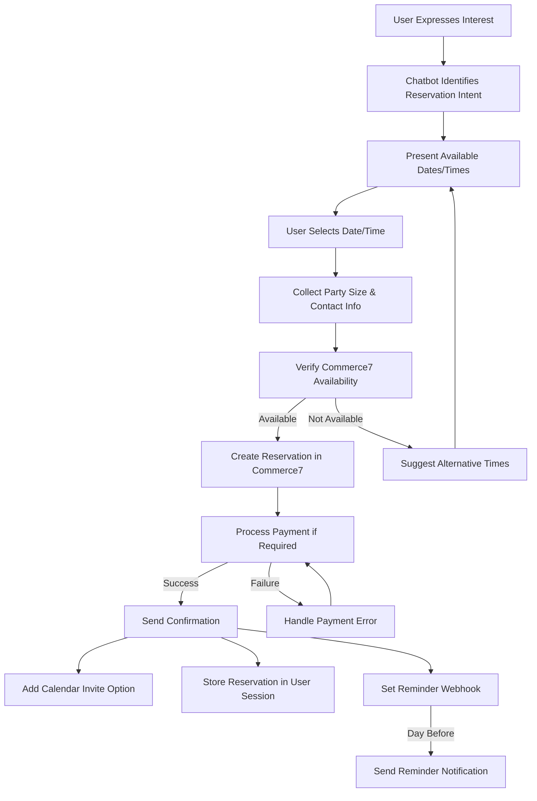
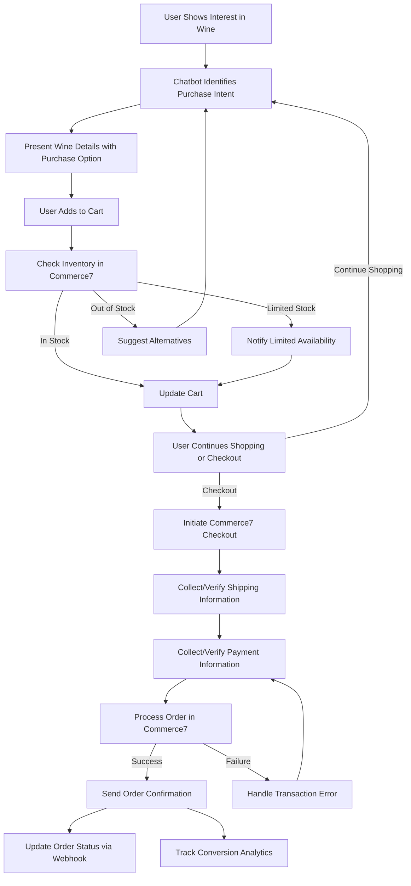
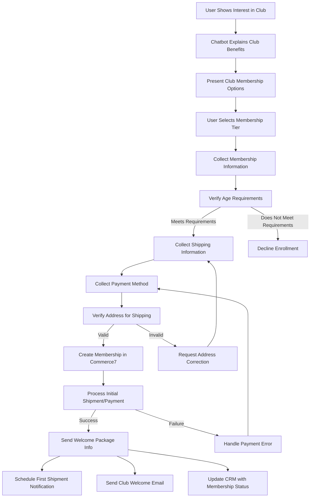
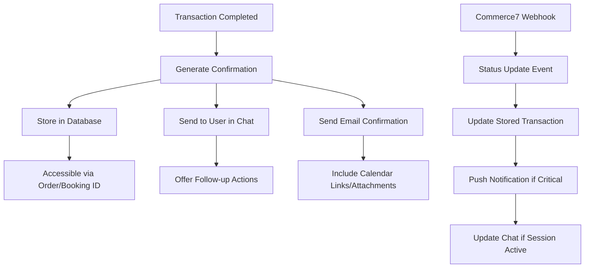

# Milea Estate Vineyard Chatbot: Transaction Handling Guide

> This document provides detailed guidance for implementing transaction flows in the Milea Estate Vineyard chatbot, focusing on reservations, purchases, and wine club enrollments. Reference this guide when developing Commerce7 integration components.

## 1. Transaction Flow Diagrams

### 1.1 Tasting/Event Reservation Flow



**Key Implementation Notes:**
- Implement date picker component in frontend React widget
- Maintain reservation state in context during multi-step process
- Verify real-time availability before confirming
- Handle party size limits and special requirements
- Support modification/cancellation flows
- Implement proper error recovery at each step

### 1.2 Wine Purchase Flow



**Key Implementation Notes:**
- Maintain shopping cart state in user session
- Implement real-time inventory verification
- Support both guest checkout and member checkout
- Consider shipping restrictions by state
- Handle promo code application
- Integrate with loyalty program if applicable
- Support order status tracking and updates

### 1.3 Wine Club Enrollment Flow



**Key Implementation Notes:**
- Clearly explain membership commitment terms
- Provide tier comparison functionality
- Verify shipping address against allowed states
- Implement strong age verification
- Support modification of club preferences
- Include cancel membership flows with retention offers
- Schedule recurring notifications for upcoming shipments

## 2. Error Handling Strategies

### 2.1 Transaction Error Catalog

| Error Type | Description | Handling Strategy |
|------------|-------------|-------------------|
| **Availability Error** | Item or time slot no longer available | 1. Refresh availability data<br>2. Offer alternatives<br>3. Allow user to modify selection |
| **Inventory Error** | Insufficient stock for purchase | 1. Update displayed inventory<br>2. Suggest similar products<br>3. Offer waitlist option |
| **Payment Decline** | Credit card declined by processor | 1. Allow retry with same card<br>2. Offer alternative payment method<br>3. Provide general decline reason |
| **Address Validation** | Shipping address invalid or restricted | 1. Highlight specific field issues<br>2. Suggest corrections<br>3. Check shipping restrictions by state |
| **API Timeout** | Commerce7 API fails to respond | 1. Implement retry with backoff<br>2. Cache critical data when possible<br>3. Graceful degradation to manual process |
| **User Session Timeout** | User takes too long in process | 1. Persist transaction state<br>2. Allow resuming from last valid step<br>3. Implement session keep-alive |
| **Data Synchronization** | Commerce7 data out of sync | 1. Implement webhook listeners<br>2. Periodic sync of critical data<br>3. Force refresh before critical transactions |
| **Rate Limit Exceeded** | Commerce7 API rate limits hit | 1. Implement request queuing<br>2. Prioritize user-facing requests<br>3. Batch background operations |

### 2.2 Error Recovery Patterns

```javascript
// Example error recovery pattern for Commerce7 transactions
async function processCommerce7Transaction(transactionType, data, retryCount = 0) {
  const MAX_RETRIES = 3;
  const BACKOFF_MS = 1000;
  
  try {
    // Validate input data before API call
    validateTransactionData(transactionType, data);
    
    // Pre-flight check (inventory, availability)
    await performPreflightCheck(transactionType, data);
    
    // Execute transaction
    const result = await executeCommerce7Transaction(transactionType, data);
    
    // Verify transaction success
    await verifyTransactionResult(result);
    
    return {
      success: true,
      transactionId: result.id,
      details: result
    };
  } catch (error) {
    // Log detailed error for tracking
    logTransactionError(transactionType, data, error);
    
    if (isRetryableError(error) && retryCount < MAX_RETRIES) {
      // Implement exponential backoff
      await sleep(BACKOFF_MS * Math.pow(2, retryCount));
      
      // Retry transaction
      return processCommerce7Transaction(
        transactionType, 
        data, 
        retryCount + 1
      );
    }
    
    // Determine user-friendly error message
    const userMessage = getUserFriendlyErrorMessage(error);
    
    // For critical failures, notify support team
    if (isCriticalError(error)) {
      notifySupportTeam(transactionType, data, error);
    }
    
    return {
      success: false,
      error: userMessage,
      errorCode: error.code,
      recoveryOptions: getRecoveryOptions(error)
    };
  }
}
```

### 2.3 User Communication During Errors

When handling transaction errors, follow these principles:

1. **Transparency** - Clearly communicate what went wrong
2. **Ownership** - Don't blame the user or third parties
3. **Next Steps** - Always provide clear recovery options
4. **Confidence** - Maintain trust in the system

**Example Error Messages:**

✅ GOOD: "We couldn't process your reservation right now. It looks like the 2pm slot just filled up. We have openings at 1pm and 3pm - would either of those work for you?"

❌ BAD: "Reservation error. Try again later."

✅ GOOD: "Your payment method was declined. You can try again with the same card or use a different payment method. Your wine selections are still saved in your cart."

❌ BAD: "Payment failed. Error code: DECLINE_AUTH_56"

## 3. Confirmation and Notification Processes

### 3.1 Confirmation System Architecture



### 3.2 Notification Types and Timing

| Event | Channel | Timing | Content |
|-------|---------|--------|---------|
| **Reservation Confirmed** | Chat + Email | Immediate | Confirmation #, date/time, party size, special notes, cancellation policy |
| **Reservation Reminder** | Email | 24 hours before | Date/time, winery address, weather forecast, what to expect |
| **Order Confirmed** | Chat + Email | Immediate | Order #, items, quantity, price, estimated shipping |
| **Order Shipped** | Email | Within 1 hour of status change | Tracking number, carrier, estimated delivery |
| **Order Delivered** | Email | Within 1 hour of status change | Delivery confirmation, feedback request, reorder prompt |
| **Club Enrollment** | Chat + Email | Immediate | Welcome message, member number, benefits summary, first shipment date |
| **Club Shipment Preparing** | Email | 7 days before processing | Upcoming wines, charge amount, option to modify |
| **Payment Method Expiring** | Email | 14 days before expiration | Prompt to update payment method, account login link |
| **Special Offer** | Email + Chat (if active) | Based on user preferences | Limited time offer, personalized selection |

### 3.3 Confirmation Message Templates

#### Reservation Confirmation

```javascript
function createReservationConfirmation(reservation) {
  return {
    title: `Your Milea Estate Vineyard Reservation Confirmed`,
    body: `
Dear ${reservation.customerName},

Your tasting reservation at Milea Estate Vineyard is confirmed!

📅 Date: ${formatDate(reservation.date)}
⏰ Time: ${formatTime(reservation.time)}
👥 Party Size: ${reservation.partySize}
🍷 Experience: ${reservation.experienceType}
${reservation.specialRequests ? `📝 Special Requests: ${reservation.specialRequests}` : ''}

Confirmation #: ${reservation.confirmationId}

What to know before your visit:
- Please arrive 10 minutes before your scheduled time
- Our address is 450 Hollow Road, Staatsburg, NY 12580
- Tastings typically last 60-90 minutes
- Weather forecast for your visit: ${reservation.weatherForecast || 'Check closer to your date'}

Need to make changes? You can modify or cancel your reservation up to 24 hours in advance. Reply to this message or call us at (845) 266-0384.

We look forward to welcoming you to Milea Estate Vineyard!

Cheers,
The Milea Team
    `,
    actions: [
      {
        type: 'calendar',
        text: 'Add to Calendar',
        data: createCalendarEvent(reservation)
      },
      {
        type: 'link',
        text: 'View on Google Maps',
        url: 'https://goo.gl/maps/...'
      },
      {
        type: 'button',
        text: 'Modify Reservation',
        callback: 'modifyReservation',
        data: reservation.confirmationId
      }
    ]
  };
}
```

#### Purchase Confirmation

```javascript
function createPurchaseConfirmation(order) {
  return {
    title: `Your Milea Estate Vineyard Order Confirmed`,
    body: `
Dear ${order.customerName},

Thank you for your purchase from Milea Estate Vineyard!

Order #: ${order.orderNumber}
Date: ${formatDate(order.orderDate)}

Items:
${order.items.map(item => `
- ${item.quantity}x ${item.productName} (${item.vintage})
  $${item.unitPrice.toFixed(2)} each - $${(item.quantity * item.unitPrice).toFixed(2)}`).join('')}

Subtotal: $${order.subtotal.toFixed(2)}
${order.discounts > 0 ? `Discounts: -$${order.discounts.toFixed(2)}` : ''}
Shipping: $${order.shipping.toFixed(2)}
Tax: $${order.tax.toFixed(2)}
Total: $${order.total.toFixed(2)}

Shipping Address:
${formatAddress(order.shippingAddress)}

Shipping Method: ${order.shippingMethod}
Estimated Delivery: ${formatDateRange(order.estimatedDelivery)}

${order.specialInstructions ? `Special Instructions: ${order.specialInstructions}` : ''}

We'll send you another notification when your order ships. If you have any questions about your order, please reply to this message or email us at orders@mileaestatevineyard.com.

Thank you for supporting our family vineyard!

Cheers,
The Milea Team
    `,
    actions: [
      {
        type: 'button',
        text: 'View Order Status',
        callback: 'viewOrderStatus',
        data: order.orderNumber
      },
      {
        type: 'link',
        text: 'Browse More Wines',
        url: 'https://mileaestatevineyard.com/shop'
      }
    ]
  };
}
```

#### Club Enrollment Confirmation

```javascript
function createClubEnrollmentConfirmation(membership) {
  return {
    title: `Welcome to the Milea Estate Vineyard Wine Club!`,
    body: `
Dear ${membership.customerName},

Welcome to the Milea Estate Vineyard Wine Club! We're thrilled to have you join our wine family.

Membership Details:
🍷 Club Level: ${membership.clubTier}
📆 First Shipment: ${formatDate(membership.firstShipmentDate)}
🔄 Frequency: ${membership.shipmentFrequency}
🏠 Shipping To: ${formatAddress(membership.shippingAddress)}

Member Benefits:
- ${membership.discountPercentage}% discount on all wine purchases
- Complimentary tastings for you and up to ${membership.guestAllowance} guests per visit
- First access to limited releases and library wines
- Special member-only events
- ${membership.additionalPerks.join('\n- ')}

Your member portal is now active, where you can:
- Update your shipping information
- Modify your wine preferences
- Add additional wines to shipments
- View upcoming club events

Your next steps:
1. Save the date for your first shipment: ${formatDate(membership.firstShipmentDate)}
2. We'll notify you 7 days before processing each shipment
3. Your credit card ending in ${membership.paymentLast4} will be charged approximately $${membership.estimatedShipmentCost.toFixed(2)} per shipment

If you have any questions about your membership, please contact our Wine Club Manager at wineclub@mileaestatevineyard.com or call (845) 266-0384 ext. 2.

Thank you for your support of our vineyard!

Cheers,
The Milea Team
    `,
    actions: [
      {
        type: 'button',
        text: 'Manage Membership',
        callback: 'manageClubMembership',
        data: membership.memberId
      },
      {
        type: 'link',
        text: 'Wine Club Benefits',
        url: 'https://mileaestatevineyard.com/wine-club'
      },
      {
        type: 'calendar',
        text: 'Add First Shipment to Calendar',
        data: createCalendarEvent({
          title: 'Milea Wine Club Shipment',
          startDate: membership.firstShipmentDate,
          description: 'Your first Milea Estate Vineyard wine club shipment will process on this date.'
        })
      }
    ]
  };
}
```

### 3.4 Webhook Implementation for Status Updates

```javascript
// Example webhook handler for Commerce7 order status updates
export async function handleCommerce7Webhook(req, res) {
  try {
    // Verify webhook signature
    verifyCommerce7WebhookSignature(req);
    
    const event = req.body;
    
    // Log incoming webhook for audit purposes
    await logWebhookEvent(event);
    
    // Process based on event type
    switch (event.type) {
      case 'order.status_update':
        await handleOrderStatusUpdate(event.data);
        break;
        
      case 'reservation.status_update':
        await handleReservationStatusUpdate(event.data);
        break;
        
      case 'club.shipment_notice':
        await handleClubShipmentNotice(event.data);
        break;
        
      case 'inventory.update':
        await handleInventoryUpdate(event.data);
        break;
        
      default:
        // Log unknown event type but still return success
        console.warn(`Unhandled webhook event type: ${event.type}`);
    }
    
    // Always respond with success to acknowledge receipt
    return res.status(200).json({ received: true });
  } catch (error) {
    console.error('Webhook processing error:', error);
    
    // Log the error but still return success to avoid retries
    // (We'll handle recovery separately through our monitoring)
    return res.status(200).json({ 
      received: true,
      error: process.env.NODE_ENV === 'development' ? error.message : 'Error processing webhook'
    });
  }
}

// Handle order status changes
async function handleOrderStatusUpdate(orderData) {
  const { orderId, newStatus, previousStatus, customer, items } = orderData;
  
  // Update order in our database
  await updateOrderStatus(orderId, newStatus);
  
  // Determine if notification needed
  const notificationNeeded = ['shipped', 'delivered', 'canceled'].includes(newStatus);
  
  if (notificationNeeded) {
    // Get customer communication preferences
    const preferences = await getCustomerPreferences(customer.id);
    
    // Create appropriate notification
    const notification = createOrderStatusNotification(
      newStatus,
      orderData
    );
    
    // Send notifications based on preferences
    if (preferences.email) {
      await sendEmail(customer.email, notification);
    }
    
    // If user has active chat session, push update there too
    const activeSessions = await findActiveCustomerSessions(customer.id);
    if (activeSessions.length > 0) {
      await sendChatNotifications(activeSessions, notification);
    }
    
    // For canceled orders, trigger recovery workflow
    if (newStatus === 'canceled' && previousStatus !== 'pending') {
      await triggerOrderRecoveryWorkflow(orderData);
    }
  }
  
  // Update analytics
  await trackOrderStatusChange(orderId, previousStatus, newStatus);
}
```

## 4. Transaction Security and Compliance

### 4.1 Secure Handling of Customer Data

For all transaction flows, implement these security practices:

1. **Data Minimization**
   - Only collect information necessary for the transaction
   - Don't store full payment details in the chatbot system
   - Defer to Commerce7's PCI-compliant payment processing

2. **Data Transmission**
   - Use TLS 1.2+ for all API communications
   - Implement HTTPS-only for all web communications
   - Avoid passing sensitive data in URL parameters

3. **Data Storage**
   - Store transaction IDs rather than full details when possible
   - Don't log sensitive information (credit card, security codes)
   - Mask or truncate sensitive fields in logs and displays

4. **Authentication**
   - Implement proper OAuth flows for Commerce7 API
   - Refresh tokens securely
   - Use appropriate scopes for API access

### 4.2 Regulatory Compliance

For wine-related transactions, be aware of these special requirements:

1. **Age Verification**
   - Implement required age verification (21+) before purchase
   - Store proof of age verification with transactions
   - Implement secondary delivery age verification flags

2. **Shipping Restrictions**
   - Maintain up-to-date database of state-by-state shipping restrictions
   - Validate addresses against allowed shipping states
   - Clearly communicate shipping limitations to users

3. **Tax Compliance**
   - Rely on Commerce7 for proper tax calculations
   - Ensure reservation and on-premise sales consider local taxes
   - Display tax information transparently during checkout

4. **Privacy Compliance**
   - Implement clear data collection disclosures
   - Provide mechanism for data access/deletion requests
   - Honor customer communication preferences

## 5. Testing and Validation Strategies

### 5.1 Transaction Testing Approach

| Test Type | Focus | Tools |
|-----------|-------|-------|
| **Unit Tests** | Individual transaction functions | Jest, Mocha |
| **Integration Tests** | Commerce7 API interaction | Supertest, Nock |
| **E2E Tests** | Complete user flows | Cypress, Playwright |
| **Performance Tests** | Response times, concurrency | k6, Artillery |
| **Security Tests** | Data protection, authentication | OWASP ZAP, manual review |

### 5.2 Test Scenarios for Transaction Flows

**Reservation Tests:**
- Successfully book a reservation with all required fields
- Handle unavailable time slots properly
- Process modifications and cancellations
- Manage concurrent bookings for the same slot
- Test reminder notifications
- Verify capacity limits are enforced

**Purchase Tests:**
- Complete purchase of in-stock items
- Handle out-of-stock scenarios gracefully
- Process different payment methods
- Apply discounts and gift cards
- Handle shipping to valid and invalid locations
- Test order status webhook processing

**Club Enrollment Tests:**
- Complete enrollment with all required fields
- Validate shipping address restrictions
- Process initial payment correctly
- Generate proper welcome sequence
- Verify club benefits are applied to account
- Test membership modification flows

### 5.3 Commerce7 Sandbox Testing

Always use Commerce7 sandbox environment for development and testing:

```javascript
// Environment-based Commerce7 API configuration
const commerce7Config = {
  baseUrl: process.env.NODE_ENV === 'production'
    ? 'https://api.commerce7.com/v1'
    : 'https://api-sandbox.commerce7.com/v1',
  clientId: process.env.COMMERCE7_CLIENT_ID,
  clientSecret: process.env.COMMERCE7_CLIENT_SECRET,
  webhookSecret: process.env.COMMERCE7_WEBHOOK_SECRET
};

// Create sandbox test orders
async function createSandboxTestOrder() {
  // Connect to sandbox API
  const sandboxClient = new Commerce7Client({
    baseUrl: 'https://api-sandbox.commerce7.com/v1',
    clientId: process.env.COMMERCE7_SANDBOX_CLIENT_ID,
    clientSecret: process.env.COMMERCE7_SANDBOX_CLIENT_SECRET
  });
  
  // Create test order
  const testOrder = await sandboxClient.orders.create({
    customer: { /* test customer data */ },
    items: [ /* test items */ ],
    shipping: { /* test shipping data */ },
    payment: { /* test payment data */ }
  });
  
  // Simulate status changes for testing
  await sandboxClient.orders.updateStatus({
    orderId: testOrder.id,
    status: 'processing'
  });
  
  return testOrder;
}
```

## 6. Transaction Monitoring and Analytics

### 6.1 Key Performance Indicators

Track these KPIs for transaction health:

1. **Conversion Metrics**
   - Reservation start → completion rate
   - Cart add → purchase completion rate
   - Club interest → enrollment rate

2. **Error Metrics**
   - Transaction error rate by type
   - Recovery success rate
   - Average resolution time

3. **Performance Metrics**
   - Average transaction completion time
   - API response times
   - Webhook processing time

4. **Business Metrics**
   - Average order value
   - Reservation show rate
   - Club member retention

### 6.2 Monitoring Implementation

```javascript
// Transaction performance monitoring middleware
function monitorTransaction(transactionType) {
  return async (req, res, next) => {
    const startTime = Date.now();
    const transactionId = req.body.id || 'unknown';
    
    // Add tracking to response object
    res.locals.transactionTracking = {
      type: transactionType,
      id: transactionId,
      startTime,
      steps: []
    };
    
    // Track transaction step
    res.trackStep = (stepName) => {
      res.locals.transactionTracking.steps.push({
        name: stepName,
        timestamp: Date.now(),
        duration: Date.now() - startTime
      });
    };
    
    // Continue with request
    next();
    
    // After response complete, log full transaction
    res.on('finish', () => {
      const duration = Date.now() - startTime;
      const success = res.statusCode >= 200 && res.statusCode < 300;
      
      // Log transaction metrics
      logTransactionMetrics({
        type: transactionType,
        id: transactionId,
        duration,
        success,
        statusCode: res.statusCode,
        steps: res.locals.transactionTracking.steps
      });
      
      // Push to monitoring system if above thresholds
      if (duration > getThreshold(transactionType) || !success) {
        alertSlowOrFailedTransaction({
          type: transactionType,
          id: transactionId,
          duration,
          success,
          statusCode: res.statusCode
        });
      }
    });
  };
}
```

## 7. Implementation Checklist

Use this checklist to track completion of transaction handling components:

### Phase 1: Foundation
- [ ] Define transaction data models
- [ ] Set up Commerce7 sandbox environment
- [ ] Implement basic API authentication
- [ ] Create error handling framework
- [ ] Set up logging and monitoring

### Phase 2: Core Flows
- [ ] Implement reservation booking flow
- [ ] Create purchase flow for single products
- [ ] Set up basic confirmation system
- [ ] Implement webhook listeners
- [ ] Add transaction status tracking

### Phase 3: Advanced Features
- [ ] Add club enrollment flow
- [ ] Implement cart management
- [ ] Create notification system
- [ ] Add payment error recovery
- [ ] Implement inventory management

### Phase 4: Optimization
- [ ] Add analytics tracking
- [ ] Optimize performance
- [ ] Enhance error recovery
- [ ] Implement A/B testing
- [ ] Add personalization features

## 8. Resources and References

### Commerce7 API Documentation
- Base URL: `https://api.commerce7.com/v1`
- Authentication: [Commerce7 Auth Guide](https://developer.commerce7.com/docs/authentication)
- Product API: [Commerce7 Product Endpoints](https://developer.commerce7.com/docs/products)
- Order API: [Commerce7 Order Endpoints](https://developer.commerce7.com/docs/orders)
- Reservation API: [Commerce7 Reservation Endpoints](https://developer.commerce7.com/docs/reservations)
- Club API: [Commerce7 Club Endpoints](https://developer.commerce7.com/docs/clubs)
- Webhook Guide: [Commerce7 Webhooks](https://developer.commerce7.com/docs/webhooks)

### Implementation Examples

**Simple Transaction Wrapper:**
```javascript
// Example transaction wrapper for Commerce7 API calls
async function commerce7Transaction(endpoint, method, data) {
  const MAX_RETRIES = 3;
  let attempt = 0;
  
  while (attempt < MAX_RETRIES) {
    try {
      // Get fresh token
      const token = await getCommerce7Token();
      
      // Make API request
      const response = await axios({
        url: `${commerce7Config.baseUrl}/${endpoint}`,
        method,
        headers: {
          'Authorization': `Bearer ${token}`,
          'Content-Type': 'application/json'
        },
        data: method !== 'GET' ? data : undefined,
        params: method === 'GET' ? data : undefined
      });
      
      return response.data;
    } catch (error) {
      // Handle specific error types
      if (isRateLimitError(error)) {
        // Wait based on retry header
        const retryAfter = getRetryAfterFromHeaders(error.response.headers);
        await sleep(retryAfter * 1000);
      } else if (isAuthError(error)) {
        // Clear token cache and retry immediately
        await clearTokenCache();
      } else if (isRetryableError(error)) {
        // Exponential backoff
        await sleep(Math.pow(2, attempt) * 1000);
      } else {
        // Non-retryable error
        throw createFormattedError(error);
      }
    }
    
    attempt++;
  }
  
  // If we've exhausted retries
  throw new Error(`Failed transaction after ${MAX_RETRIES} attempts`);
}
```

## 9. Additional Best Practices

### Transaction State Management

For multi-step transactions, implement proper state management:

1. **Session-Based Approach**
   - Store transaction state in user session
   - Implement recovery for interrupted sessions
   - Clear sensitive data when appropriate

2. **Progress Tracking**
   - Show clear progress indicators to users
   - Allow returning to previous steps
   - Implement partial save functionality

3. **Timeouts and Expirations**
   - Set appropriate timeouts for transaction steps
   - Handle reservation/cart expiration gracefully
   - Implement keep-alive mechanisms for longer flows

### Balancing User Experience and Business Rules

1. **Flexibility vs. Rules**
   - Allow reasonable modifications to reservations
   - Implement clear cancellation policies
   - Balance inventory protection with customer satisfaction

2. **Recovery Options**
   - For failed reservations, always offer alternatives
   - For inventory issues, suggest similar products
   - For club enrollment issues, offer temporary solutions

3. **Personalization Touches**
   - Acknowledge returning customers in confirmations
   - Reference past purchases in recommendations
   - Tailor notifications based on customer preferences

---

*This Transaction Handling Guide is part of the Milea Estate Vineyard Chatbot development documentation. Reference this document when implementing Commerce7 integration components and transaction flows.*
